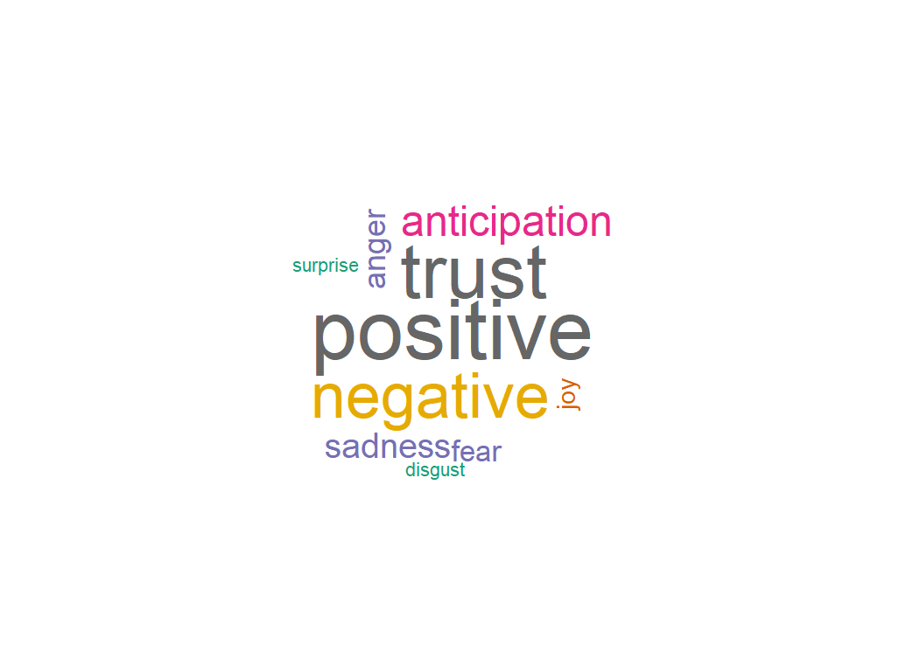
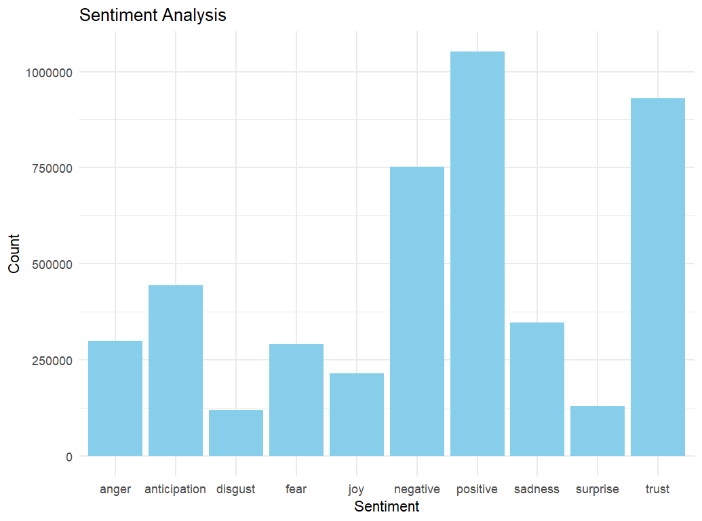
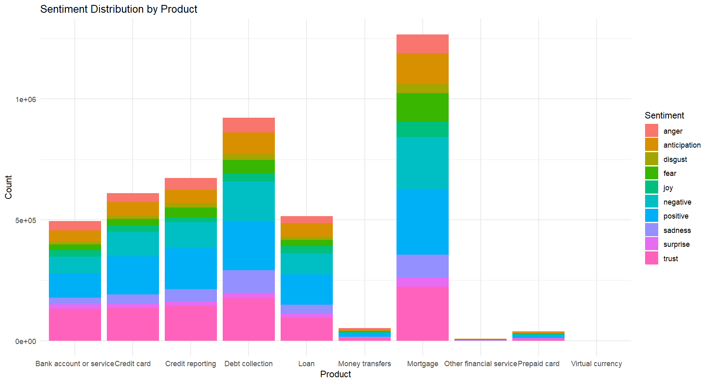
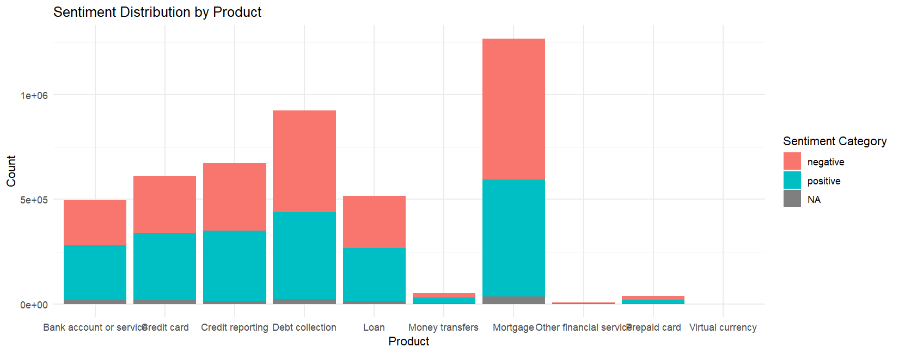

# Sentiment Analysis

## Contributor
Nicholas Camacho

## Introduction
In this project I analyzed consumer complaint data using text mining and sentiment analysis. I created 3 charts and a word plot using the data to show information I thought was interesting. I will be including a raw file of my R script that I used which will include everything. Some things may seem weird because i took time off and forgot how things worked and used chat gpt to work. 

## Data Cleaning 
1. I started by cleaning the Product column
   - I first did a ggplot of the data so I can easily find overlapping values that can fall under the same category. I decided to put all the different types of loans under "Loans"
```
ggplot(complaints, aes(x = Product)) +
  geom_bar(fill = "skyblue", color = "black") +
  theme_minimal() +
  theme(axis.text.x = element_text(angle = 45, hjust = 1)) +  
  labs(x = "Product", y = "Count", title = "Count of Each Product")

complaints$Product <- ifelse(complaints$Product %in% c("Consumer Loan", "Payday loan", "Student loan"), "Loan", complaints$Product)

```
2. I did the same thing for the Sub.product column
```
ggplot(complaints, aes(x = Sub.product)) +
  geom_bar(fill = "skyblue", color = "black") +
  theme_minimal() +
  theme(axis.text.x = element_text(angle = 45, hjust = 1)) +  
  labs(x = "Product", y = "Count", title = "Count of Each Product")

complaints$Product <- ifelse(complaints$Product %in% c("Consumer Loan", "Payday loan", "Student loan"), "Loan", complaints$Product)
complaints$Sub.product <- ifelse(complaints$Sub.product %in% c("Vehicle lease", "Vehicle loan" , "Auto"), "Vehicle", complaints$Sub.product)
complaints$Sub.product <- ifelse(complaints$Sub.product %in% c("Credit repair", "Personal line of credit"), "Personal Credit", complaints$Sub.product)
complaints$Sub.product <- ifelse(complaints$Sub.product %in% c("Conventional fixed mortgage", "Conventional adjustable mortgage (ARM)" , "FHA mortgage", "Other mortgage" , "Second mortgage" , "VA mortgage" , "Reverse mortgage"), "Mortgage", complaints$Sub.product)
complaints$Sub.product <- ifelse(complaints$Sub.product %in% c("Domestic (US) money transfer", "International money transfer"), "Money transfer", complaints$Sub.product)
complaints$Sub.product <- ifelse(complaints$Sub.product %in% c("Cashing a check without an account"), "Check cashing", complaints$Sub.product)
complaints$Sub.product <- ifelse(complaints$Sub.product %in% c("Federal student loan" , "Federal student loan servicing" , "Non-federal student loan"), "Student loan", complaints$Sub.product)
complaints$Sub.product <- ifelse(complaints$Sub.product %in% c("Electronic Benefit Transfer / EBT card" , "General purpose card" , "Payroll card", "Transit card","Other special purpose card","ID prepaid card","Gift or merchant card"), "Specialty Card", complaints$Sub.product)
```

#Charts
1. I first made a wordcloud of the emotion associated with the words each sentiment. Results came from nrc lexicon. Positive and Negative were about the same in terms of number but when you include the other word, negative words does appear more than positive words which is expected.



2. I created a bar graph using ggplot2 to show the frequency of the Sentiments



4. I also created a segmented bar graph to show each of the feelings in each Product that was being complained

  

Mortgage seems to have the biggest as it is the most reported product. One thing I found interesting was that each bar has a somewhat equal size in each sentiment compared to the overall size of the bar.

# Finding a way to make the data more clean/tidy
- I realized that many of the smaller sentiment words that were used can contribute to a bigger word - Positive or Negative. I decided to change most of the sentiments to be either positive or negative. I did this by using these functions:
```
map_sentiment <- function(sentiment) {
  if (sentiment_word %in% c("anger", "disgust", "fear", "negative", "sadness", "anticipation")) {
    return("negative")
  } else if (sentiment %in% c("joy", "positive", "trust")) {
    return("positive")
  } else {
    return(NA)
  }
}
sentiments_nrc2$category <- ifelse(sentiments_nrc2$sentiment %in% c("anger", "disgust", "fear", "negative", "sadness", "anticipation"),
                                  "negative",
                                  ifelse(sentiments_nrc2$sentiment %in% c("joy", "positive", "trust"),
                                         "positive",
                                         NA))
```

- Slightly more negative than positive sentiments is expected since the word cloud gave us a glimpse of it, but I am surprised at how close they are and how much we N/A
